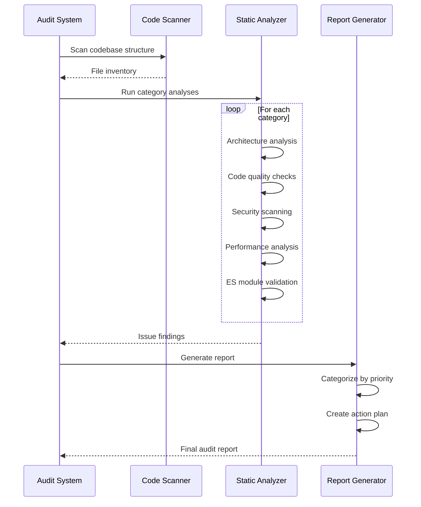

# Design Document: ClaudeFlow Comprehensive Audit

## Overview

This design document outlines a comprehensive audit system for the ClaudeFlow project - an intelligent API router optimized for Anthropic's Claude models. The audit will systematically analyze the codebase across 10 major categories, identifying issues by priority, providing actionable recommendations, and creating a prioritized action plan for improvements.

The audit system combines automated analysis tools with manual code review patterns to ensure thorough coverage of architecture, code quality, security, performance, and operational concerns.

## Main Algorithm/Workflow



## Audit Categories and Methodology

### 1. Architecture & Design Patterns

**Objective**: Evaluate module organization, design pattern usage, and architectural decisions.

**Analysis Approach**:

```typescript
interface ArchitectureAnalysis {
  moduleStructure: ModuleStructureCheck;
  designPatterns: DesignPatternCheck;
  dependencyGraph: DependencyAnalysis;
  scalabilityAssessment: ScalabilityCheck;
}

interface ModuleStructureCheck {
  // Check separation of concerns
  checkSeparationOfConcerns(): Issue[];
  
  // Validate directory organization
  validateDirectoryStructure(): Issue[];
  
  // Check for circular dependencies
  detectCircularDependencies(): Issue[];
  
  // Analyze module cohesion
  analyzeCohesion(): Issue[];
}
```

**Checks**:
- Module organization follows single responsibility principle
- Clear separation between layers (server, parsers, optimizers, infrastructure)
- Appropriate use of design patterns (Factory, Strategy, Singleton)
- Dependency injection vs tight coupling
- Circular dependency detection
- Module size and complexity metrics

**Tools**:
- Manual code review
- Dependency graph analysis (madge, dependency-cruiser)
- TypeScript compiler API for import analysis

---

### 2. Code Quality

**Objective**: Assess TypeScript usage, function complexity, code duplication, and naming conventions.

**Analysis Approach**:

```typescript
interface CodeQualityAnalysis {
  typeScriptUsage: TypeScriptCheck;
  functionComplexity: ComplexityCheck;
  codeDuplication: DuplicationCheck;
  namingConventions: NamingCheck;
  commentQuality: CommentCheck;
}

interface TypeScriptCheck {
  // Find usage of 'any' type
  findAnyUsage(): Issue[];
  
  // Check for proper type annotations
  checkTypeAnnotations(): Issue[];
  
  // Validate interface vs type usage
  validateTypeDefinitions(): Issue[];
  
  // Check for type assertions
  findTypeAssertions(): Issue[];
}

interface ComplexityCheck {
  // Calculate cyclomatic complexity
  calculateComplexity(functionNode: FunctionNode): number;
  
  // Find long functions (>50 lines)
  findLongFunctions(): Issue[];
  
  // Find deeply nested code (>4 levels)
  findDeepNesting(): Issue[];
}
```

**Checks**:
- TypeScript `any` usage (should be minimal)
- Missing type annotations
- Function length (ideal: 10-30 lines, warning: >50 lines)
- Cyclomatic complexity (warning: >10, error: >20)
- Code duplication (>5 lines repeated)
- Naming conventions (camelCase, PascalCase, UPPER_SNAKE_CASE)
- Comment quality (WHY vs WHAT)
- Magic numbers/strings

**Tools**:
- ESLint with TypeScript rules
- SonarQube or similar static analysis
- jscpd for duplication detection
- TypeScript compiler diagnostics

---

### 3. ES Module Compliance

**Objective**: Ensure all imports use proper `.js` extensions and explicit file paths.

**Analysis Approach**:

```typescript
interface ESModuleAnalysis {
  importStatements: ImportCheck;
  exportStatements: ExportCheck;
  moduleResolution: ResolutionCheck;
}

interface ImportCheck {
  // Find imports without .js extension
  findMissingExtensions(): Issue[];
  
  // Find directory imports without index.js
  findDirectoryImports(): Issue[];
  
  // Validate relative vs absolute imports
  validateImportPaths(): Issue[];
}
```

**Checks**:
- All imports include `.js` extension
- No directory imports without explicit `/index.js`
- Proper module resolution configuration in tsconfig.json
- Consistent use of relative vs absolute imports
- Barrel exports (index.ts) properly configured

**Tools**:
- Custom AST parser (TypeScript Compiler API)
- Regex pattern matching
- Manual verification of recent fixes

**Recent Context**:
- 16 files recently fixed for ES module compliance
- Need to verify no regressions introduced

---

### 4. Error Handling

**Objective**: Evaluate error handling comprehensiveness and patterns.

**Analysis Approach**:

```typescript
interface ErrorHandlingAnalysis {
  errorCoverage: ErrorCoverageCheck;
  errorTypes: ErrorTypeCheck;
  errorPropagation: PropagationCheck;
  loggingPractices: LoggingCheck;
}

interface ErrorCoverageCheck {
  // Find async functions without try-catch
  findUnhandledAsync(): Issue[];
  
  // Find promise chains without .catch()
  findUnhandledPromises(): Issue[];
  
  // Check error handling in critical paths
  checkCriticalPaths(): Issue[];
}

interface ErrorTypeCheck {
  // Find generic Error usage
  findGenericErrors(): Issue[];
  
  // Validate custom error types
  validateCustomErrors(): Issue[];
  
  // Check error message quality
  checkErrorMessages(): Issue[];
}
```

**Checks**:
- All async functions have try-catch blocks
- Custom error types for different error scenarios
- Proper error propagation (not swallowing errors)
- Structured logging with context
- Error recovery strategies
- User-facing error messages are clear

**Tools**:
- ESLint rules for error handling
- Manual code review of critical paths
- Grep for error patterns

---

### 5. Testing

**Objective**: Assess test coverage, quality, and patterns.

**Analysis Approach**:

```typescript
interface TestingAnalysis {
  coverage: CoverageCheck;
  testQuality: QualityCheck;
  testPatterns: PatternCheck;
  mockUsage: MockCheck;
}

interface CoverageCheck {
  // Calculate line coverage
  calculateLineCoverage(): number;
  
  // Calculate branch coverage
  calculateBranchCoverage(): number;
  
  // Find untested critical paths
  findUntestedCriticalPaths(): Issue[];
}

interface QualityCheck {
  // Check test naming conventions
  checkTestNames(): Issue[];
  
  // Find tests with multiple assertions
  findComplexTests(): Issue[];
  
  // Check test isolation
  checkTestIsolation(): Issue[];
}
```

**Checks**:
- Overall test coverage (target: >80% for business logic)
- Critical path coverage (target: 100%)
- Test naming conventions (descriptive, follows pattern)
- Test isolation (no shared state)
- Property-based testing usage
- Mock usage (appropriate vs excessive)
- Integration test coverage

**Tools**:
- Jest coverage reports
- Manual test review
- Coverage visualization

**Current Status**:
- 205 tests passing across 15 test suites
- Need to analyze coverage gaps

---

### 6. Security

**Objective**: Identify security vulnerabilities and risks.

**Analysis Approach**:

```typescript
interface SecurityAnalysis {
  inputValidation: ValidationCheck;
  injectionPrevention: InjectionCheck;
  secretManagement: SecretCheck;
  authSecurity: AuthCheck;
}

interface ValidationCheck {
  // Find unvalidated user input
  findUnvalidatedInput(): Issue[];
  
  // Check validation completeness
  checkValidationRules(): Issue[];
  
  // Find missing sanitization
  findMissingSanitization(): Issue[];
}

interface InjectionCheck {
  // Check for SQL injection risks
  checkSQLInjection(): Issue[];
  
  // Check for XSS risks
  checkXSS(): Issue[];
  
  // Check for command injection
  checkCommandInjection(): Issue[];
}

interface SecretCheck {
  // Find hardcoded secrets
  findHardcodedSecrets(): Issue[];
  
  // Check environment variable usage
  checkEnvVarUsage(): Issue[];
  
  // Validate secret storage
  validateSecretStorage(): Issue[];
}
```

**Checks**:
- Input validation on all user-provided data
- SQL injection prevention (parameterized queries)
- XSS prevention (output sanitization)
- Secret management (no hardcoded keys)
- Authentication/authorization implementation
- Rate limiting
- CORS configuration
- Dependency vulnerabilities

**Tools**:
- npm audit
- Snyk or similar security scanner
- Manual code review of auth flows
- Regex patterns for secret detection

---

### 7. Performance

**Objective**: Analyze performance characteristics and optimization opportunities.

**Analysis Approach**:

```typescript
interface PerformanceAnalysis {
  cachingStrategies: CachingCheck;
  databaseOptimization: DatabaseCheck;
  memoryManagement: MemoryCheck;
  asyncPatterns: AsyncCheck;
}

interface CachingCheck {
  // Analyze cache hit rates
  analyzeCacheEffectiveness(): Issue[];
  
  // Check cache invalidation
  checkCacheInvalidation(): Issue[];
  
  // Find missing cache opportunities
  findCachingOpportunities(): Issue[];
}

interface DatabaseCheck {
  // Find N+1 query patterns
  findNPlusOneQueries(): Issue[];
  
  // Check index usage
  checkIndexUsage(): Issue[];
  
  // Analyze query complexity
  analyzeQueryComplexity(): Issue[];
}
```

**Checks**:
- Caching strategies (Redis, Qdrant, semantic deduplication)
- Database query optimization
- Memory leak detection
- Async/await patterns (avoid blocking)
- Unnecessary computations
- Large object allocations
- Stream processing for large data

**Tools**:
- Node.js profiler
- Memory heap snapshots
- Manual code review
- Performance benchmarks

---

### 8. Documentation

**Objective**: Evaluate documentation completeness and quality.

**Analysis Approach**:

```typescript
interface DocumentationAnalysis {
  codeDocumentation: CodeDocCheck;
  apiDocumentation: APIDocCheck;
  architectureDocumentation: ArchDocCheck;
  readmeCompleteness: ReadmeCheck;
}

interface CodeDocCheck {
  // Find undocumented public APIs
  findUndocumentedAPIs(): Issue[];
  
  // Check JSDoc completeness
  checkJSDocQuality(): Issue[];
  
  // Find outdated comments
  findOutdatedComments(): Issue[];
}
```

**Checks**:
- JSDoc comments on public APIs
- README completeness
- API documentation (docs/API.md)
- Architecture documentation
- Setup instructions
- Deployment guide
- Inline comments (WHY not WHAT)

**Tools**:
- Manual review
- Documentation coverage tools
- Link checker for docs

---

### 9. Configuration & Environment

**Objective**: Assess configuration management and environment handling.

**Analysis Approach**:

```typescript
interface ConfigurationAnalysis {
  envVarManagement: EnvVarCheck;
  configValidation: ValidationCheck;
  defaultValues: DefaultCheck;
}

interface EnvVarCheck {
  // Find missing environment variables
  findMissingEnvVars(): Issue[];
  
  // Check .env.example completeness
  checkEnvExample(): Issue[];
  
  // Validate environment variable usage
  validateEnvUsage(): Issue[];
}
```

**Checks**:
- Environment variable management
- Configuration validation (Zod schema)
- Default values appropriateness
- .env.example completeness
- Configuration hot reload
- Multi-environment support

**Tools**:
- Manual review
- Configuration schema validation
- Environment variable tracking

---

### 10. Dependencies

**Objective**: Analyze dependency health and management.

**Analysis Approach**:

```typescript
interface DependencyAnalysis {
  versionManagement: VersionCheck;
  unusedDependencies: UnusedCheck;
  securityVulnerabilities: VulnerabilityCheck;
  licenseCompatibility: LicenseCheck;
}

interface VersionCheck {
  // Check for pinned vs range versions
  checkVersionStrategy(): Issue[];
  
  // Find outdated dependencies
  findOutdatedDeps(): Issue[];
  
  // Check for major version updates
  checkMajorUpdates(): Issue[];
}

interface UnusedCheck {
  // Find unused dependencies
  findUnusedDeps(): Issue[];
  
  // Find missing dependencies
  findMissingDeps(): Issue[];
}
```

**Checks**:
- Dependency versions (pinned vs ranges)
- Unused dependencies
- Security vulnerabilities (npm audit)
- License compatibility
- Dependency size and impact
- Transitive dependency issues

**Tools**:
- npm audit
- depcheck for unused dependencies
- license-checker
- bundlephobia for size analysis

---

## Issue Priority System

### Priority Levels

**CRITICAL** (P0):
- Security vulnerabilities (SQL injection, XSS, auth bypass)
- Data loss risks
- System-breaking bugs
- Production outages

**HIGH** (P1):
- Breaking changes without migration path
- Major bugs affecting core functionality
- Performance degradation (>50% slower)
- Missing error handling in critical paths

**MEDIUM** (P2):
- Code quality issues (high complexity, duplication)
- Minor bugs
- Performance issues (<50% impact)
- Missing tests for non-critical paths
- Documentation gaps

**LOW** (P3):
- Tech debt
- Code style inconsistencies
- Minor optimizations
- Nice-to-have improvements

**BACKLOG** (P4):
- Future enhancements
- Experimental ideas
- Long-term refactoring

---

## Scoring System

### Overall Health Score

```typescript
interface HealthScore {
  overall: number; // 0-100
  categories: {
    architecture: number; // 0-100
    codeQuality: number; // 0-100
    esModuleCompliance: number; // 0-100
    errorHandling: number; // 0-100
    testing: number; // 0-100
    security: number; // 0-100
    performance: number; // 0-100
    documentation: number; // 0-100
    configuration: number; // 0-100
    dependencies: number; // 0-100
  };
}

function calculateCategoryScore(issues: Issue[]): number {
  const weights = {
    critical: -25,
    high: -10,
    medium: -5,
    low: -2,
    backlog: 0
  };
  
  let score = 100;
  
  for (const issue of issues) {
    score += weights[issue.priority];
  }
  
  return Math.max(0, Math.min(100, score));
}

function calculateOverallScore(categoryScores: CategoryScores): number {
  const weights = {
    architecture: 0.15,
    codeQuality: 0.15,
    esModuleCompliance: 0.05,
    errorHandling: 0.10,
    testing: 0.10,
    security: 0.20, // Highest weight
    performance: 0.10,
    documentation: 0.05,
    configuration: 0.05,
    dependencies: 0.05
  };
  
  let weightedSum = 0;
  
  for (const [category, score] of Object.entries(categoryScores)) {
    weightedSum += score * weights[category];
  }
  
  return Math.round(weightedSum);
}
```

---

## Audit Execution Plan

### Phase 1: Automated Analysis (2-3 hours)

```typescript
async function runAutomatedAnalysis(): Promise<AutomatedResults> {
  // 1. Run ESLint with TypeScript rules
  const eslintResults = await runESLint();
  
  // 2. Run TypeScript compiler diagnostics
  const tscResults = await runTypeScriptCompiler();
  
  // 3. Run npm audit for security
  const npmAuditResults = await runNpmAudit();
  
  // 4. Run test coverage
  const coverageResults = await runTestCoverage();
  
  // 5. Run dependency analysis
  const depResults = await runDependencyAnalysis();
  
  // 6. Run code duplication detection
  const duplicationResults = await runDuplicationDetection();
  
  // 7. Analyze ES module compliance
  const esModuleResults = await analyzeESModules();
  
  return {
    eslint: eslintResults,
    typescript: tscResults,
    security: npmAuditResults,
    coverage: coverageResults,
    dependencies: depResults,
    duplication: duplicationResults,
    esModules: esModuleResults
  };
}
```

### Phase 2: Manual Code Review (4-6 hours)

```typescript
async function runManualReview(): Promise<ManualResults> {
  // 1. Architecture review
  const architectureIssues = await reviewArchitecture();
  
  // 2. Design pattern review
  const designPatternIssues = await reviewDesignPatterns();
  
  // 3. Error handling review
  const errorHandlingIssues = await reviewErrorHandling();
  
  // 4. Security review (auth, validation)
  const securityIssues = await reviewSecurity();
  
  // 5. Performance review (caching, queries)
  const performanceIssues = await reviewPerformance();
  
  // 6. Test quality review
  const testQualityIssues = await reviewTestQuality();
  
  // 7. Documentation review
  const documentationIssues = await reviewDocumentation();
  
  return {
    architecture: architectureIssues,
    designPatterns: designPatternIssues,
    errorHandling: errorHandlingIssues,
    security: securityIssues,
    performance: performanceIssues,
    testQuality: testQualityIssues,
    documentation: documentationIssues
  };
}
```

### Phase 3: Report Generation (1-2 hours)

```typescript
async function generateAuditReport(
  automated: AutomatedResults,
  manual: ManualResults
): Promise<AuditReport> {
  // 1. Merge and categorize all issues
  const allIssues = mergeIssues(automated, manual);
  
  // 2. Calculate scores
  const scores = calculateScores(allIssues);
  
  // 3. Generate recommendations
  const recommendations = generateRecommendations(allIssues);
  
  // 4. Create action plan
  const actionPlan = createActionPlan(allIssues);
  
  // 5. Highlight best practices
  const bestPractices = identifyBestPractices();
  
  return {
    executiveSummary: generateExecutiveSummary(scores, allIssues),
    scores: scores,
    issuesByCategory: categorizeIssues(allIssues),
    issuesByPriority: prioritizeIssues(allIssues),
    recommendations: recommendations,
    actionPlan: actionPlan,
    bestPractices: bestPractices,
    detailedFindings: allIssues
  };
}
```

---

## Report Structure

### Executive Summary

```typescript
interface ExecutiveSummary {
  overallScore: number; // 0-100
  totalIssues: number;
  issuesByPriority: {
    critical: number;
    high: number;
    medium: number;
    low: number;
    backlog: number;
  };
  topRecommendations: string[]; // Top 5
  estimatedEffort: string; // e.g., "2-3 weeks"
}
```

### Category Breakdown

For each of the 10 categories:

```typescript
interface CategoryReport {
  categoryName: string;
  score: number; // 0-100
  issueCount: number;
  issues: Issue[];
  recommendations: string[];
  bestPractices: string[];
}
```

### Issue Detail

```typescript
interface Issue {
  id: string; // e.g., "ARCH-001"
  category: AuditCategory;
  priority: Priority;
  title: string;
  description: string;
  location: {
    file: string;
    line?: number;
    function?: string;
  };
  impact: string;
  recommendation: string;
  effort: 'low' | 'medium' | 'high';
  references?: string[]; // Links to docs, best practices
}
```

### Action Plan

```typescript
interface ActionPlan {
  immediate: Action[]; // Critical issues, do now
  shortTerm: Action[]; // High priority, 1-2 weeks
  mediumTerm: Action[]; // Medium priority, 1-2 months
  longTerm: Action[]; // Low priority, 3+ months
  backlog: Action[]; // Nice-to-have
}

interface Action {
  issueIds: string[];
  title: string;
  description: string;
  estimatedEffort: string;
  dependencies: string[]; // Other actions that must complete first
  impact: string;
}
```

---

## Correctness Properties

### Property 1: Completeness

```typescript
// All files in the codebase must be analyzed
∀ file ∈ codebase: file ∈ analyzedFiles

// All 10 categories must have results
∀ category ∈ auditCategories: category ∈ reportCategories
```

### Property 2: Accuracy

```typescript
// Issue locations must be valid
∀ issue ∈ issues: 
  fileExists(issue.location.file) ∧
  (issue.location.line === undefined ∨ 
   lineExists(issue.location.file, issue.location.line))

// Scores must be in valid range
∀ score ∈ scores: 0 ≤ score ≤ 100
```

### Property 3: Consistency

```typescript
// Priority assignment must be consistent
∀ issue1, issue2 ∈ issues:
  (issue1.type === issue2.type ∧ 
   issue1.severity === issue2.severity) ⟹
  issue1.priority === issue2.priority

// Category scores must match issue counts
∀ category ∈ categories:
  category.score === calculateScore(category.issues)
```

### Property 4: Actionability

```typescript
// Every issue must have a recommendation
∀ issue ∈ issues: 
  issue.recommendation ≠ null ∧ 
  issue.recommendation.length > 0

// Every critical/high issue must be in action plan
∀ issue ∈ issues:
  (issue.priority === 'critical' ∨ issue.priority === 'high') ⟹
  ∃ action ∈ actionPlan: issue.id ∈ action.issueIds
```

---

## Tools and Technologies

### Static Analysis Tools

```typescript
interface AuditTools {
  linting: {
    eslint: 'TypeScript rules, security rules',
    prettier: 'Code formatting check'
  };
  
  typeChecking: {
    tsc: 'TypeScript compiler diagnostics',
    tsCompilerAPI: 'Custom AST analysis'
  };
  
  security: {
    npmAudit: 'Dependency vulnerabilities',
    snyk: 'Advanced security scanning (optional)',
    secretScanner: 'Hardcoded secret detection'
  };
  
  testing: {
    jest: 'Test execution and coverage',
    coverageReporter: 'Coverage visualization'
  };
  
  dependencies: {
    depcheck: 'Unused dependency detection',
    npmOutdated: 'Outdated package detection',
    licenseChecker: 'License compatibility'
  };
  
  codeQuality: {
    jscpd: 'Code duplication detection',
    complexityAnalyzer: 'Cyclomatic complexity',
    madge: 'Dependency graph visualization'
  };
}
```

### Custom Analysis Scripts

```typescript
// ES Module compliance checker
async function checkESModuleCompliance(): Promise<Issue[]> {
  const issues: Issue[] = [];
  const sourceFiles = await glob('src/**/*.ts');
  
  for (const file of sourceFiles) {
    const content = await readFile(file, 'utf-8');
    const ast = parseTypeScript(content);
    
    // Check import statements
    for (const importNode of ast.imports) {
      if (!importNode.source.endsWith('.js')) {
        issues.push({
          id: generateId('ESM'),
          category: 'esModuleCompliance',
          priority: 'high',
          title: 'Missing .js extension in import',
          description: `Import statement missing .js extension`,
          location: { file, line: importNode.line },
          impact: 'Runtime module resolution failure',
          recommendation: 'Add .js extension to import path',
          effort: 'low'
        });
      }
    }
  }
  
  return issues;
}

// Architecture analyzer
async function analyzeArchitecture(): Promise<Issue[]> {
  const issues: Issue[] = [];
  
  // Check for circular dependencies
  const graph = await buildDependencyGraph();
  const cycles = detectCycles(graph);
  
  for (const cycle of cycles) {
    issues.push({
      id: generateId('ARCH'),
      category: 'architecture',
      priority: 'high',
      title: 'Circular dependency detected',
      description: `Circular dependency: ${cycle.join(' -> ')}`,
      location: { file: cycle[0] },
      impact: 'Tight coupling, difficult to test and maintain',
      recommendation: 'Refactor to break circular dependency',
      effort: 'medium'
    });
  }
  
  return issues;
}
```

---

## Deliverables

### 1. Comprehensive Audit Report (Markdown)

**File**: `audit-report.md`

**Contents**:
- Executive Summary
- Overall Health Score
- Category Breakdown (10 categories)
- Issue Details (all findings)
- Recommendations
- Action Plan
- Best Practices Identified

### 2. Issue Tracking Spreadsheet (CSV)

**File**: `audit-issues.csv`

**Columns**:
- Issue ID
- Category
- Priority
- Title
- Description
- File
- Line
- Impact
- Recommendation
- Effort
- Status (Open/In Progress/Resolved)

### 3. Action Plan (Markdown)

**File**: `action-plan.md`

**Contents**:
- Immediate Actions (Critical)
- Short-term Actions (High)
- Medium-term Actions (Medium)
- Long-term Actions (Low)
- Backlog Items

### 4. Metrics Dashboard (JSON)

**File**: `audit-metrics.json`

**Contents**:
```json
{
  "overallScore": 85,
  "categoryScores": {
    "architecture": 90,
    "codeQuality": 85,
    "esModuleCompliance": 95,
    "errorHandling": 80,
    "testing": 75,
    "security": 90,
    "performance": 85,
    "documentation": 70,
    "configuration": 90,
    "dependencies": 85
  },
  "issueCount": {
    "critical": 2,
    "high": 8,
    "medium": 25,
    "low": 40,
    "backlog": 15
  },
  "testCoverage": {
    "line": 82,
    "branch": 75,
    "function": 85,
    "statement": 82
  },
  "codeMetrics": {
    "totalFiles": 150,
    "totalLines": 12000,
    "averageComplexity": 5.2,
    "duplicationPercentage": 3.5
  }
}
```

---

## Success Criteria

### Audit Completeness

- ✅ All 10 categories analyzed
- ✅ All source files scanned
- ✅ All automated tools executed
- ✅ Manual review completed for critical areas
- ✅ Report generated with actionable recommendations

### Quality Metrics

- ✅ Every issue has file location
- ✅ Every issue has priority assigned
- ✅ Every issue has recommendation
- ✅ Action plan covers all critical/high issues
- ✅ Best practices identified and documented

### Actionability

- ✅ Issues are specific (not vague)
- ✅ Recommendations are concrete
- ✅ Effort estimates provided
- ✅ Dependencies identified
- ✅ Examples provided where helpful

---

## Timeline

**Total Estimated Time**: 8-12 hours

**Phase 1: Automated Analysis** (2-3 hours)
- Run all automated tools
- Collect and parse results
- Generate initial issue list

**Phase 2: Manual Review** (4-6 hours)
- Architecture review
- Security review
- Performance review
- Code quality review
- Documentation review

**Phase 3: Report Generation** (1-2 hours)
- Categorize and prioritize issues
- Calculate scores
- Generate recommendations
- Create action plan
- Write executive summary

**Phase 4: Review and Refinement** (1 hour)
- Validate findings
- Ensure completeness
- Proofread report
- Generate deliverables

---

## Post-Audit Process

### Issue Tracking

```typescript
interface IssueTracking {
  // Store issues in adaptive memory
  storeInMemory(issues: Issue[]): Promise<void>;
  
  // Track resolution progress
  trackProgress(issueId: string, status: IssueStatus): Promise<void>;
  
  // Generate progress reports
  generateProgressReport(): Promise<ProgressReport>;
}
```

### Continuous Monitoring

```typescript
interface ContinuousMonitoring {
  // Run automated checks on commit
  preCommitHook(): Promise<Issue[]>;
  
  // Run full audit monthly
  scheduledAudit(): Promise<AuditReport>;
  
  // Track metrics over time
  trackMetricsTrend(): Promise<MetricsTrend>;
}
```

### Re-audit Schedule

- **Immediate**: Fix critical issues
- **1 week**: Re-audit critical areas
- **1 month**: Re-audit high priority areas
- **3 months**: Full re-audit
- **6 months**: Comprehensive re-audit

---

## Conclusion

This comprehensive audit design provides a systematic approach to analyzing the ClaudeFlow codebase across 10 major categories. By combining automated tools with manual review, the audit will identify issues, prioritize them by impact, and provide actionable recommendations for improvement.

The audit will deliver:
1. **Comprehensive Report** - Detailed findings across all categories
2. **Prioritized Action Plan** - Clear roadmap for improvements
3. **Health Score** - Quantitative measure of codebase quality
4. **Best Practices** - Identification of what's working well
5. **Continuous Improvement** - Framework for ongoing quality monitoring

The result will be a clear understanding of the codebase's strengths and weaknesses, with a concrete plan for addressing issues and maintaining high code quality going forward.
