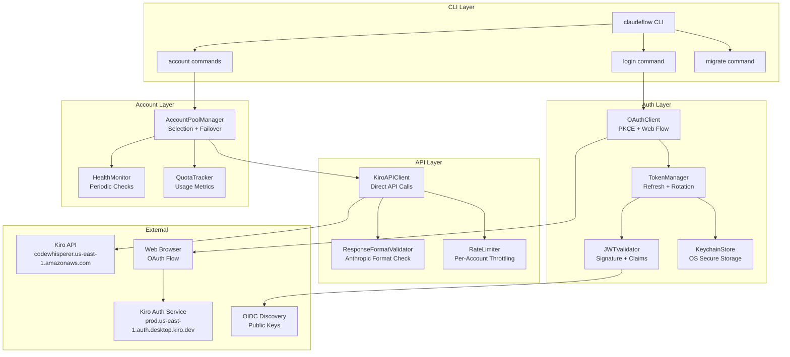
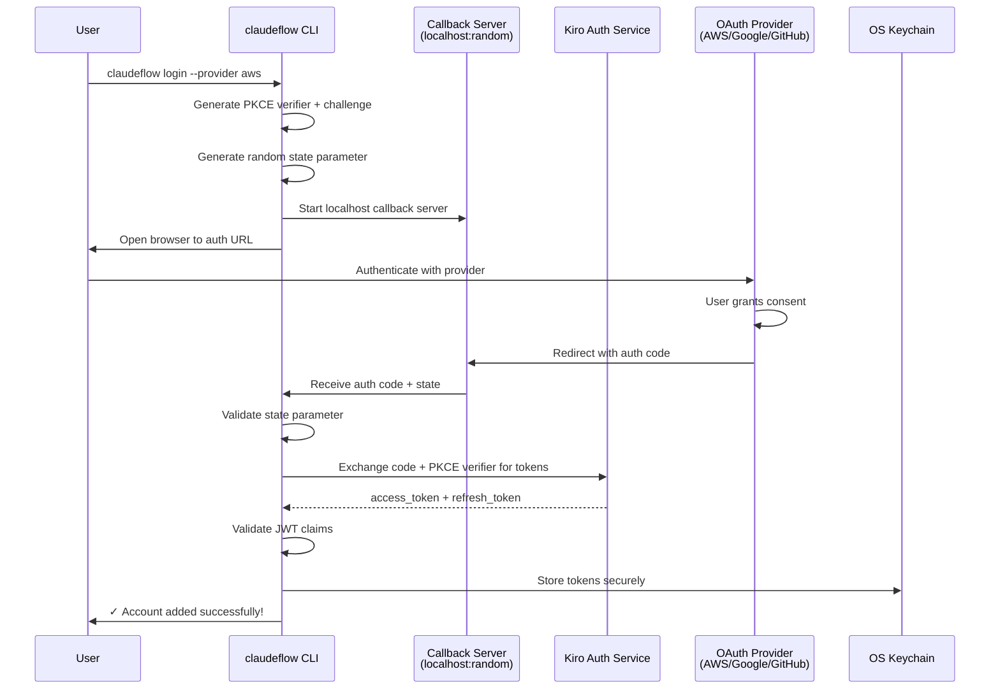
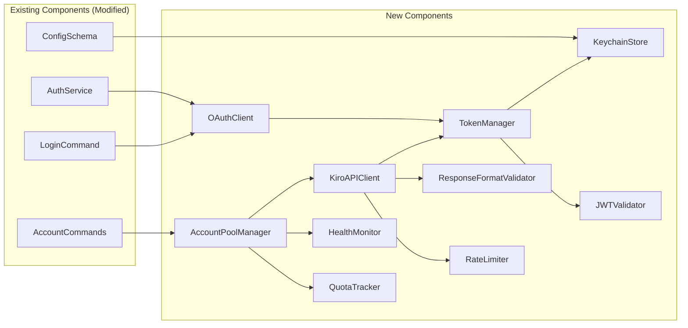
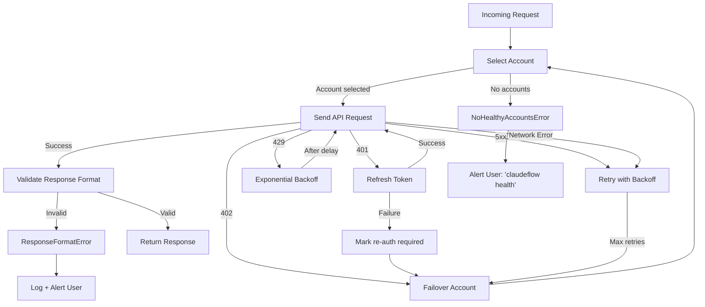

# Design Document: ClaudeFlow Kiro OAuth Implementation

## Overview

This design replaces ClaudeFlow's broken authentication system—which relies on non-existent OAuth endpoints and the 9router proxy (which converts Anthropic format to OpenAI format, losing prompt caching and extended thinking)—with **direct Kiro OAuth authentication**. The new system authenticates directly with Kiro via web-based OAuth (AWS Builder ID, Google, GitHub), calls the Kiro API directly without any intermediary, and preserves 100% native Anthropic format throughout.

### Problem Statement

The current implementation has three critical flaws:
1. **Broken OAuth endpoints**: The system attempts to call OAuth endpoints that don't exist on the 9router
2. **9router dependency**: The 9router converts Anthropic format to OpenAI format, losing prompt caching, extended thinking, and other Claude-specific features
3. **Insecure credential handling**: Session tokens are stored in config files alongside API keys

### Solution Approach

Implement a complete OAuth 2.0 + PKCE flow that communicates directly with Kiro's AWS-based infrastructure, eliminating the 9router entirely. The design follows the architecture established by the kiro-gateway reference implementation.

### Key Design Decisions

| Decision | Rationale |
|----------|-----------|
| PKCE for OAuth (no client secret) | ClaudeFlow is a public client (CLI/desktop app); PKCE provides secure auth without exposing secrets |
| OS keychain for credential storage | Plaintext config files are insecure; OS keychains provide hardware-backed encryption |
| Dual auth mode (Desktop vs SSO) | Kiro supports two authentication flows; auto-detection simplifies user experience |
| Direct API calls (no proxy) | Eliminates format conversion, preserves all Anthropic features |
| Zod schema validation | Consistent with existing codebase patterns (`src/config/schema.ts`) |
| Circuit breaker for failover | Prevents cascading failures when accounts become unhealthy |

---

## Architecture

### High-Level Architecture



### OAuth 2.0 + PKCE Flow



### Component Dependency Graph



---

## Components and Interfaces

### 1. OAuthClient

Handles the complete OAuth 2.0 + PKCE flow for Kiro authentication.

```typescript
interface OAuthClientConfig {
  provider: 'aws' | 'google' | 'github';
  region: string;
  callbackPort?: number;
}

interface OAuthTokens {
  accessToken: string;
  refreshToken: string;
  expiresAt: Date;
  tokenType: 'Bearer';
}

interface PKCEChallenge {
  verifier: string;
  challenge: string;
  method: 'S256';
}

interface OAuthState {
  state: string;
  codeVerifier: string;
  provider: OAuthProvider;
  redirectUri: string;
}

class OAuthClient {
  // Generate PKCE code verifier (43-128 chars, URL-safe)
  generatePKCE(): PKCEChallenge;

  // Build OAuth authorization URL with PKCE
  buildAuthorizationUrl(config: OAuthClientConfig, pkce: PKCEChallenge, state: string): string;

  // Start local callback server on random port
  startCallbackServer(): Promise<{ port: number; redirectUri: string }>;

  // Wait for authorization code from callback
  waitForCallback(state: string, timeoutMs: number): Promise<string>;

  // Exchange authorization code for tokens
  exchangeCodeForTokens(code: string, codeVerifier: string, config: OAuthClientConfig): Promise<OAuthTokens>;

  // Full login flow: open browser → wait → exchange → return tokens
  login(config: OAuthClientConfig): Promise<OAuthTokens>;

  // Non-interactive login with existing token (for CI/CD)
  loginWithToken(token: string, config: OAuthClientConfig): Promise<OAuthTokens>;
}
```

### 2. KeychainStore

Secure credential storage using OS-native keychain APIs.

```typescript
interface KeychainCredentials {
  accessToken: string;
  refreshToken: string;
  clientSecret?: string;  // Only for AWS SSO mode
}

class KeychainStore {
  // Store credentials for an account
  store(accountId: string, credentials: KeychainCredentials): Promise<void>;

  // Retrieve credentials for an account
  retrieve(accountId: string): Promise<KeychainCredentials | null>;

  // Delete credentials for an account
  delete(accountId: string): Promise<void>;

  // Check if credentials exist for an account
  exists(accountId: string): Promise<boolean>;

  // Detect available OS keychain backend
  detectBackend(): 'macos-keychain' | 'windows-credential-manager' | 'libsecret' | 'fallback-encrypted';
}
```

**Fallback Strategy**: If OS keychain is unavailable (headless CI, container), fall back to an encrypted file (`~/.claudeflow/credentials.enc`) using AES-256-GCM with a key derived from the machine ID.

### 3. TokenManager

Manages token lifecycle: refresh, rotation, and expiry monitoring.

```typescript
interface TokenRefreshResult {
  success: boolean;
  accessToken: string;
  refreshToken: string;
  expiresAt: Date;
  refreshedAt: Date;
}

class TokenManager {
  // Determine auth mode from stored credentials
  detectAuthMode(accountId: string): 'kiro-desktop' | 'aws-sso';

  // Get the appropriate token endpoint based on auth mode
  getTokenEndpoint(accountId: string, region: string): string;

  // Refresh an expired access token using refresh token
  refresh(accountId: string): Promise<TokenRefreshResult>;

  // Batch refresh multiple accounts in parallel
  refreshAll(accountIds: string[]): Promise<Map<string, TokenRefreshResult>>;

  // Check if token needs refresh (within 5-minute buffer)
  needsRefresh(accountId: string): Promise<boolean>;

  // Start background refresh worker (checks every minute)
  startRefreshWorker(): void;

  // Stop background refresh worker
  stopRefreshWorker(): void;
}
```

### 4. JWTValidator

Validates JWT tokens for security.

```typescript
interface JWTClaims {
  iss: string;       // Issuer
  aud: string;       // Audience
  sub: string;       // Subject
  exp: number;       // Expiration (Unix timestamp)
  iat: number;       // Issued at (Unix timestamp)
  scope?: string;    // Token scope
}

interface JWTValidationResult {
  valid: boolean;
  claims?: JWTClaims;
  error?: string;
}

class JWTValidator {
  // Fetch OIDC public keys from discovery endpoint (cached 24h)
  fetchPublicKeys(discoveryUrl: string): Promise<Map<string, string>>;

  // Validate JWT signature and claims
  validate(token: string, expectedIssuer: string, expectedAudience: string): Promise<JWTValidationResult>;

  // Decode JWT without validation (for inspection)
  decode(token: string): JWTClaims;

  // Check if token is expired
  isExpired(token: string): boolean;
}
```

### 5. KiroAPIClient

Direct communication with Kiro API (no proxy/9router).

```typescript
interface KiroAPIConfig {
  region: string;
  timeout: {
    connect: number;  // 10 seconds
    read: number;     // 60 seconds
  };
  retries: number;    // max 3
}

interface KiroAPIError {
  statusCode: number;
  message: string;
  type: 'auth' | 'rate-limit' | 'quota' | 'server' | 'network';
  retryable: boolean;
  retryAfter?: number;  // seconds
}

class KiroAPIClient {
  // Send request to Kiro API
  sendRequest(request: AnthropicRequest, accessToken: string, config: KiroAPIConfig): Promise<AnthropicResponse>;

  // Send streaming request (SSE)
  sendStreamingRequest(request: AnthropicRequest, accessToken: string, config: KiroAPIConfig): AsyncIterable<string>;

  // Minimal health check request
  healthCheck(accessToken: string, config: KiroAPIConfig): Promise<boolean>;

  // Get API endpoint URL for region
  getEndpoint(region: string): string;
}
```

### 6. DualAuthModeHandler

Auto-detects and handles both authentication modes.

```typescript
interface AuthModeConfig {
  mode: 'kiro-desktop' | 'aws-sso';
  tokenEndpoint: string;
  requiresClientSecret: boolean;
}

class DualAuthModeHandler {
  // Detect auth mode from stored credentials
  detectMode(credentials: KeychainCredentials): AuthModeConfig;

  // Get token endpoint for detected mode
  getTokenEndpoint(mode: AuthModeConfig, region: string): string;

  // Build refresh request body based on mode
  buildRefreshRequest(refreshToken: string, mode: AuthModeConfig): Record<string, string>;
}
```

### 7. Enhanced AccountPoolManager

Extended from existing `AccountPoolManager` with new features.

```typescript
interface KiroPoolAccount {
  id: string;
  provider: 'kiro';
  region: string;
  profileArn: string;
  expiresAt: string;
  lastUsed: number;
  requestCount: number;
  errorCount: number;
  priority: number;
  status: 'healthy' | 'unhealthy' | 'expired' | 're-auth-required';
  quota: AccountQuota;
}

interface AccountSelectionStrategy {
  type: 'round-robin' | 'priority-based' | 'quota-aware';
  selectAccount(accounts: KiroPoolAccount[], context: SelectionContext): KiroPoolAccount;
}

class EnhancedAccountPoolManager {
  // Select best account based on strategy
  selectAccount(strategy: AccountSelectionStrategy): Promise<KiroPoolAccount>;

  // Mark account as unhealthy after errors
  markUnhealthy(accountId: string, reason: string): void;

  // Mark account as healthy after successful health check
  markHealthy(accountId: string): void;

  // Get all accounts with their status
  getAccountStatuses(): AccountStatus[];

  // Failover to next available account
  failover(currentAccountId: string): Promise<KiroPoolAccount>;

  // Start periodic health checks (every 5 minutes)
  startHealthChecks(): void;

  // Stop health checks
  stopHealthChecks(): void;
}
```

### 8. CLI Commands

New and updated CLI commands.

```typescript
// Login command (complete rewrite)
claudeflow login [--provider aws|google|github] [--region region] [--token token]

// Account management commands (enhanced)
claudeflow account list [--json]
claudeflow account remove <account-id>
claudeflow account refresh <account-id>
claudeflow account test <account-id>
claudeflow account set-priority <account-id> <priority>

// Migration command (new)
claudeflow migrate from-9router

// Diagnostic command (new)
claudeflow debug validate-response

// Quota command (enhanced)
claudeflow quota show

// Health command (enhanced)
claudeflow health
```

---

## Data Models

### Configuration Schema Update

The existing Zod-based configuration schema will be extended with a new `KiroOAuthAccount` type in the discriminated union.

```typescript
// New Kiro OAuth account schema (replaces old OAuthAccountSchema)
const KiroOAuthAccountSchema = z.object({
  id: z.string().regex(/^kiro-[a-f0-9]+$/, 'Must be format: kiro-{hash}'),
  provider: z.literal('kiro'),
  region: z.enum(['us-east-1', 'us-west-2', 'eu-central-1', 'ap-southeast-1']),
  profileArn: z.string().regex(
    /^arn:aws:codewhisperer:[a-z0-9-]+:[0-9]+:profile\/[a-zA-Z0-9-]+$/,
    'Must be valid AWS ARN for CodeWhisperer profile'
  ),
  expiresAt: z.string().datetime(),
  lastUsed: z.number().optional().default(0),
  requestCount: z.number().int().nonnegative().optional().default(0),
  errorCount: z.number().int().nonnegative().optional().default(0),
  priority: z.number().int().min(0).max(100).optional().default(0),
  // credentials: NOT stored here - stored in OS keychain
}).strict();

// Updated discriminated union
const AccountSchema = z.discriminatedUnion('provider', [
  AnthropicAccountSchema,
  ProxyAccountSchema,
  KiroOAuthAccountSchema,   // NEW: replaces OAuthAccountSchema
  OAuthAccountSchema,        // DEPRECATED: kept for migration
]);

// Migration schema for old format detection
const LegacyOAuthAccountSchema = z.object({
  id: z.string(),
  provider: z.literal('kiro'),
  apiKey: z.string(),
  kiroConfig: z.object({
    machineId: z.string(),
    mitmRouterUrl: z.string().url(),
    sessionToken: z.string().optional(),
    sessionExpiry: z.date().optional(),
    combo: z.any().optional(),
  }),
});
```

### Keychain Storage Format

```typescript
interface KeychainEntry {
  service: 'claudeflow';
  account: string;  // account ID (e.g., "kiro-abc123")
  credentials: {
    accessToken: string;
    refreshToken: string;
    clientSecret?: string;    // Only for AWS SSO mode
    clientId?: string;        // Only for AWS SSO mode
    tokenExpiry: string;      // ISO 8601
    refreshExpiry?: string;   // ISO 8601 (if known)
  };
}
```

### In-Memory Account State

```typescript
interface RuntimeAccountState {
  accountId: string;
  status: 'healthy' | 'unhealthy' | 'expired' | 're-auth-required' | 'unknown';
  consecutiveErrors: number;
  lastHealthCheck: Date;
  lastError?: string;
  currentQuota: {
    requestsPerMinute: { used: number; limit: number };
    requestsPerHour: { used: number; limit: number };
    requestsPerDay: { used: number; limit: number };
    resetTime: Date;
  };
  circuitBreaker: {
    state: 'closed' | 'open' | 'half-open';
    failureCount: number;
    lastFailureTime?: Date;
    openUntil?: Date;
  };
}
```

### API Response Types (Anthropic Format)

```typescript
// Already exists in src/types/anthropic.types.ts - no changes needed
interface AnthropicResponse {
  id: string;            // starts with "msg_"
  type: 'message';
  role: 'assistant';
  content: ContentBlock[];
  model: string;
  stop_reason: string | null;
  usage: {
    input_tokens: number;
    output_tokens: number;
    cache_creation_input_tokens?: number;
    cache_read_input_tokens?: number;
  };
}
```

### Rate Limit Headers

```typescript
interface RateLimitInfo {
  limit: number;
  remaining: number;
  reset: number;  // Unix timestamp
  retryAfter?: number;  // seconds (from 429 response)
}
```

---

## Correctness Properties

*A property is a characteristic or behavior that should hold true across all valid executions of a system—essentially, a formal statement about what the system should do. Properties serve as the bridge between human-readable specifications and machine-verifiable correctness guarantees.*

### Property 1: PKCE Challenge Round-Trip

*For any* URL-safe random string used as a PKCE code verifier, the SHA-256 hash base64url-encoded as the challenge must be deterministically verifiable: `base64url(sha256(verifier)) == challenge`.

**Validates: Requirements 1.4**

### Property 2: OAuth State Validation

*For any* generated OAuth state parameter and any received state parameter, the validation function SHALL return `true` if and only if the two values are identical (constant-time comparison to prevent timing attacks).

**Validates: Requirements 1.7**

### Property 3: Auth Mode Detection

*For any* set of stored credentials, the system SHALL detect `aws-sso` mode if and only if both `clientId` and `clientSecret` are present and non-empty; otherwise it SHALL detect `kiro-desktop` mode.

**Validates: Requirements 2.1, 2.2, 2.3**

### Property 4: Endpoint URL Construction

*For any* valid region string and detected auth mode, the system SHALL produce the correct token endpoint URL: `https://prod.{region}.auth.desktop.kiro.dev/refreshToken` for Kiro Desktop mode, and `https://oidc.{region}.amazonaws.com/token` for AWS SSO mode.

**Validates: Requirements 2.4, 2.5, 2.6**

### Property 5: Config Serialization Excludes Sensitive Data

*For any* KiroOAuthAccount configuration object, the serialized JSON output SHALL NOT contain any of these keys: `accessToken`, `refreshToken`, `clientSecret`, `apiKey`, `sessionToken`. This property holds regardless of the account state or credentials stored in the keychain.

**Validates: Requirements 3.6, 3.7, 11.3, 19.6, 20.1-20.6**

### Property 6: Token Refresh Need Detection

*For any* token with expiry time `T` and current time `now`, the `needsRefresh` function SHALL return `true` if and only if `0 < T - now < 5 minutes` (token expires within 5 minutes but hasn't expired yet).

**Validates: Requirements 4.2**

### Property 7: Token Refresh Updates Stored Credentials

*For any* account with stored credentials and any successful token refresh result containing new `accessToken`, `refreshToken`, and `expiresAt`, the updated stored credentials SHALL exactly match the refresh result values (token rotation).

**Validates: Requirements 4.4, 4.6**

### Property 8: Failed Refresh Marks Re-auth Required

*For any* token refresh operation that fails with HTTP status 401 or 403, the account SHALL be marked with status `re-auth-required`.

**Validates: Requirements 4.5**

### Property 9: Exponential Backoff Invariant

*For any* sequence of retry attempts (up to max 3), the delay between attempts SHALL be monotonically increasing with an exponential factor: `delay(n) >= 2^n * base_delay` for attempt `n`. After 3 failures, no further retries occur.

**Validates: Requirements 4.9, 7.10, 13.8**

### Property 10: JWT Claim Validation

*For any* JWT token, the validator SHALL accept the token if and only if ALL of the following hold: `iss` matches expected issuer, `aud` matches expected audience, `exp > now`, and `iat <= now`. Any single violation causes rejection.

**Validates: Requirements 5.1-5.7**

### Property 11: Account ID Format

*For any* valid profile ARN string, the generated account ID SHALL match the pattern `kiro-[a-f0-9]+` and SHALL be deterministic (same ARN always produces same ID).

**Validates: Requirements 6.2**

### Property 12: Account Selection Returns Valid Healthy Account

*For any* non-empty set of accounts with at least one healthy account, the account selection function SHALL return an account that is: (a) a member of the input set, (b) has status `healthy`, and (c) has remaining quota.

**Validates: Requirements 6.5, 6.6, 6.7**

### Property 13: Unhealthy After Three Consecutive Errors

*For any* account, after recording 3 consecutive error events without any intervening success, the account status SHALL transition to `unhealthy`. Any success resets the consecutive error count to 0.

**Validates: Requirements 6.8, 15.5, 15.6**

### Property 14: API Request Format Correctness

*For any* valid Anthropic API request and access token, the outgoing HTTP request SHALL include: (a) `Authorization: Bearer {token}` header, (b) `anthropic-version: 2023-06-01` header, (c) request body in Anthropic format (NOT OpenAI format - no `messages` array wrapper at top level with `model` as sibling).

**Validates: Requirements 7.2, 7.3, 7.4**

### Property 15: Response Format Validation

*For any* API response object, the `ResponseFormatValidator.isAnthropicFormat()` function SHALL return `true` if and only if the response has: `id` starting with "msg_", `type: "message"`, `role: "assistant"`, `content` as array of valid content blocks, `model` as string, and `usage` with `input_tokens`/`output_tokens`. Responses with OpenAI-specific fields (`choices`, `object: "chat.completion"`) SHALL be rejected.

**Validates: Requirements 7.5, 7.6, 8.1-8.5**

### Property 16: Error Classification

*For any* HTTP error response, the system SHALL classify status codes as: 401 → `auth` error (triggers refresh), 429 → `rate-limit` error (triggers backoff), 402 → `quota` error (triggers failover), 5xx → `server` error (retryable), network errors → `network` error (retryable).

**Validates: Requirements 7.8**

### Property 17: Schema Validation Accepts/Rejects Correctly

*For any* JavaScript object, the Zod schema SHALL accept it as a valid `KiroOAuthAccount` if and only if: `provider` is `"kiro"`, `region` is in the whitelist `["us-east-1", "us-west-2", "eu-central-1", "ap-southeast-1"]`, `profileArn` matches the ARN pattern, `expiresAt` is a valid ISO 8601 datetime, `id` matches `kiro-{hex}`, and no unknown fields are present (strict mode). Unknown fields SHALL cause rejection.

**Validates: Requirements 11.1, 11.4, 11.5, 11.6, 19.8**

### Property 18: Log Sanitization

*For any* log message string, the sanitization function SHALL ensure that any sequence matching common token patterns (Bearer tokens, long hex strings >20 chars, base64 strings >20 chars) is replaced with a masked version showing only the last 4 characters: `****abcd`.

**Validates: Requirements 12.1, 12.2**

### Property 19: Circuit Breaker State Machine

*For any* sequence of success/failure events, the circuit breaker SHALL: start in `closed` state, transition to `open` after 5 consecutive failures, transition from `open` to `half-open` after 60 seconds, transition from `half-open` to `closed` on success, and from `half-open` to `open` on failure. In `open` state, all requests SHALL be rejected immediately.

**Validates: Requirements 17.6, 17.7**

### Property 20: Configuration Round-Trip

*For any* valid `KiroOAuthAccount` object, serializing to JSON and then parsing back SHALL produce an equivalent object (deep equality, excluding undefined optional fields). Similarly, for any valid complete `Config` object, `parse(serialize(config))` SHALL produce an equivalent `Config`.

**Validates: Requirements 19.1, 19.2**

### Property 21: Migration Preserves Equivalence

*For any* valid legacy `OAuthAccount` configuration (old format with `kiroConfig`, `apiKey`, `mitmRouterUrl`), the migration function SHALL produce a valid `KiroOAuthAccount` that preserves the account identity (same `id`) and non-sensitive metadata. The migration SHALL validate the result against the new schema before accepting.

**Validates: Requirements 11.9, 16.7, 16.10**

### Property 22: Case-Insensitive Field Parsing

*For any* configuration field name expressed in either `snake_case` or `camelCase` (e.g., `profile_arn` vs `profileArn`, `request_count` vs `requestCount`), the parser SHALL correctly map it to the canonical internal field name.

**Validates: Requirements 19.10**

---

## Error Handling

### Error Classification

Errors are classified into two categories:

| Category | Examples | Strategy |
|----------|----------|----------|
| **Transient** | Network timeout, 429 rate limit, 5xx server error | Retry with exponential backoff |
| **Permanent** | 401 auth failure (after refresh), 402 quota exhausted, invalid config | Alert user, suggest action |

### Error Response Hierarchy

```typescript
class ClaudeFlowError extends Error {
  constructor(
    message: string,
    public code: string,
    public statusCode?: number,
    public retryable: boolean = false
  ) { super(message); }
}

class AuthenticationError extends ClaudeFlowError {
  // 401, 403 - triggers re-auth flow
  constructor(accountId: string, reason: string) {
    super(`Authentication failed for ${accountId}: ${reason}`, 'AUTH_FAILED', 401, false);
  }
}

class TokenRefreshError extends ClaudeFlowError {
  // Token refresh failed - may need re-login
  constructor(accountId: string, reason: string) {
    super(`Token refresh failed for ${accountId}: ${reason}`, 'TOKEN_REFRESH_FAILED', undefined, true);
  }
}

class RateLimitError extends ClaudeFlowError {
  // 429 - backoff and retry
  constructor(accountId: string, retryAfter: number) {
    super(`Rate limited on ${accountId}`, 'RATE_LIMITED', 429, true);
    this.retryAfter = retryAfter;
  }
  retryAfter: number;
}

class QuotaExhaustedError extends ClaudeFlowError {
  // 402 - failover to next account
  constructor(accountId: string) {
    super(`Quota exhausted for ${accountId}`, 'QUOTA_EXHAUSTED', 402, false);
  }
}

class ResponseFormatError extends ClaudeFlowError {
  // Non-Anthropic format response
  constructor(provider: string, details: string) {
    super(`Invalid response format from ${provider}: ${details}`, 'INVALID_FORMAT', undefined, false);
  }
}

class CircuitBreakerOpenError extends ClaudeFlowError {
  // All accounts unhealthy
  constructor(accountId: string, retryAt: Date) {
    super(`Circuit breaker open for ${accountId}`, 'CIRCUIT_OPEN', undefined, true);
    this.retryAt = retryAt;
  }
  retryAt: Date;
}

class NoHealthyAccountsError extends ClaudeFlowError {
  // All accounts in pool are down
  constructor() {
    super('No healthy accounts available', 'NO_HEALTHY_ACCOUNTS', undefined, false);
  }
}
```

### Error Recovery Flow



### User-Facing Error Messages

| Error | Message | Action |
|-------|---------|--------|
| Auth failed | "Authentication failed: {reason}. Please run: `claudeflow login`" | Re-authenticate |
| Token expired | "Token expired for {account}. Please run: `claudeflow login`" | Re-authenticate |
| Rate limited | "Rate limit reached. Retrying in {seconds}s..." | Automatic |
| Quota exhausted | "Quota exhausted for {account}. Switching to next account." | Automatic |
| No healthy accounts | "No healthy accounts available. Run: `claudeflow health`" | Manual investigation |
| Invalid format | "Response format validation failed for {account}." | Check account compatibility |
| Circuit breaker | "Account {id} is in cooldown. Will retry in {seconds}s." | Automatic |

---

## Testing Strategy

### Testing Approach

This feature involves substantial pure logic (token validation, config parsing/serialization, format validation, state machines) that is highly amenable to **property-based testing (PBT)**. We use a dual approach:

- **Property-based tests**: Verify universal properties across generated inputs (primary coverage)
- **Unit tests**: Verify specific examples, edge cases, and integration points (targeted coverage)

### PBT Library

**fast-check** for TypeScript/Node.js — well-maintained, native TypeScript support, integrates with Jest.

```bash
npm install --save-dev fast-check
```

### Property Test Configuration

- Minimum **100 iterations** per property test
- Each test tagged with: `Feature: claudeflow-kiro-oauth-implementation, Property {number}: {title}`
- Custom arbitraries for domain types (KiroAccount, JWT claims, tokens, etc.)

### Custom Arbitraries

```typescript
// KiroOAuthAccount generator
const kiroAccountArbitrary = fc.record({
  id: fc.stringMatching(/^kiro-[a-f0-9]{8,32}$/),
  provider: fc.constant('kiro'),
  region: fc.constantFrom('us-east-1', 'us-west-2', 'eu-central-1', 'ap-southeast-1'),
  profileArn: fc.stringMatching(/^arn:aws:codewhisperer:[a-z0-9-]+:[0-9]+:profile\/[a-zA-Z0-9-]+$/),
  expiresAt: fc.date().map(d => d.toISOString()),
  lastUsed: fc.option(fc.nat(), { nil: undefined }),
  requestCount: fc.option(fc.nat(), { nil: undefined }),
  errorCount: fc.option(fc.nat(), { nil: undefined }),
  priority: fc.option(fc.integer({ min: 0, max: 100 }), { nil: undefined }),
});

// PKCE verifier generator
const pkceVerifierArbitrary = fc.stringOf(
  fc.constantFrom(...'ABCDEFGHIJKLMNOPQRSTUVWXYZabcdefghijklmnopqrstuvwxyz0123456789-._~'),
  { minLength: 43, maxLength: 128 }
);

// JWT claims generator
const jwtClaimsArbitrary = fc.record({
  iss: fc.webUrl(),
  aud: fc.string({ minLength: 1 }),
  sub: fc.string({ minLength: 1 }),
  exp: fc.integer({ min: 0 }),
  iat: fc.integer({ min: 0 }),
  scope: fc.option(fc.string()),
});
```

### Test Categories

| Category | Count | Description |
|----------|-------|-------------|
| **Property Tests** | 22 | Universal properties from Correctness Properties section |
| **Unit Tests** | ~30 | Specific examples, edge cases, error conditions |
| **Integration Tests** | ~15 | Keychain operations, HTTP mocking, full OAuth flow |
| **CLI Tests** | ~10 | Command parsing, output formatting |

### Unit Test Focus Areas

1. **PKCE Generation**: Verify specific examples of SHA-256 challenges
2. **OAuth URL Construction**: Verify URLs for each provider
3. **Error Messages**: Snapshot test error message formatting
4. **CLI Commands**: Commander.js command registration and option parsing
5. **Edge Cases**: Empty strings, maximum-length strings, Unicode in tokens, expired tokens

### Integration Test Focus Areas

1. **Keychain Store/Retrieve Round-Trip**: Mock keychain backend (1-3 examples per platform)
2. **Full OAuth Flow**: Mock browser + callback server + Kiro auth endpoint
3. **Token Refresh Flow**: Mock Kiro token endpoint with various responses
4. **Account Pool Failover**: Simulate account failures and verify failover
5. **Health Check Cycle**: Simulate health check success/failure sequences
6. **Migration Flow**: Old config → migration → verify new config + keychain storage

### Smoke Tests

1. TLS 1.2+ enforcement on HTTPS connections
2. Service starts with valid configuration
3. Health endpoint responds correctly

### Test File Organization

```
tests/
  property/
    pkce.property.test.ts          # Property 1
    oauth-state.property.test.ts    # Property 2
    auth-mode.property.test.ts      # Property 3
    endpoint-url.property.test.ts   # Property 4
    config-serialization.property.test.ts  # Properties 5, 20
    token-refresh.property.test.ts  # Properties 6, 7, 8, 9
    jwt-validation.property.test.ts # Property 10
    account-id.property.test.ts     # Property 11
    account-selection.property.test.ts  # Properties 12, 13
    api-request.property.test.ts    # Properties 14, 16
    response-format.property.test.ts # Property 15
    schema-validation.property.test.ts # Property 17
    log-sanitization.property.test.ts # Property 18
    circuit-breaker.property.test.ts # Property 19
    migration.property.test.ts      # Property 21
    case-insensitive.property.test.ts # Property 22
  unit/
    oauth-client.test.ts
    keychain-store.test.ts
    token-manager.test.ts
    jwt-validator.test.ts
    kiro-api-client.test.ts
    rate-limiter.test.ts
    health-monitor.test.ts
    circuit-breaker.test.ts
    error-handling.test.ts
  integration/
    oauth-flow.integration.test.ts
    token-refresh.integration.test.ts
    account-pool.integration.test.ts
    migration.integration.test.ts
    cli-commands.integration.test.ts
```
